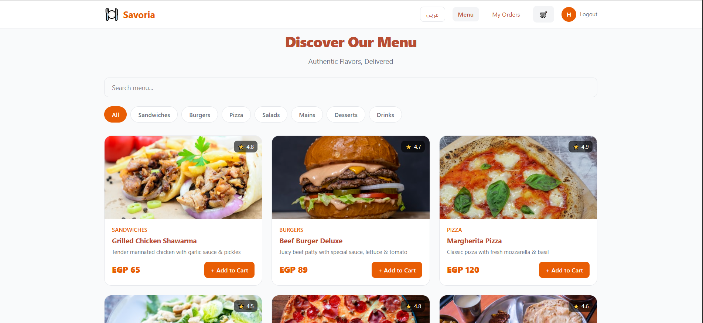
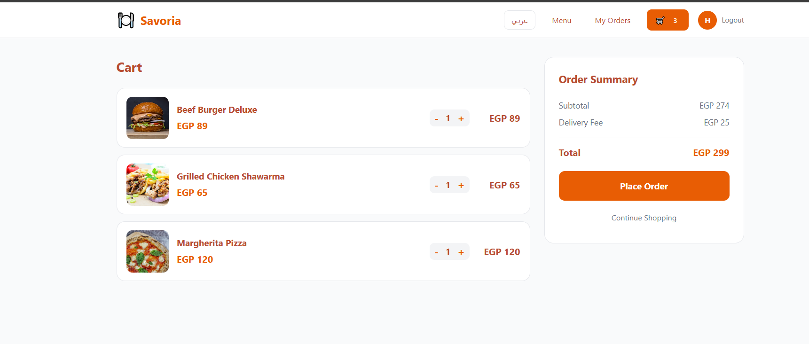
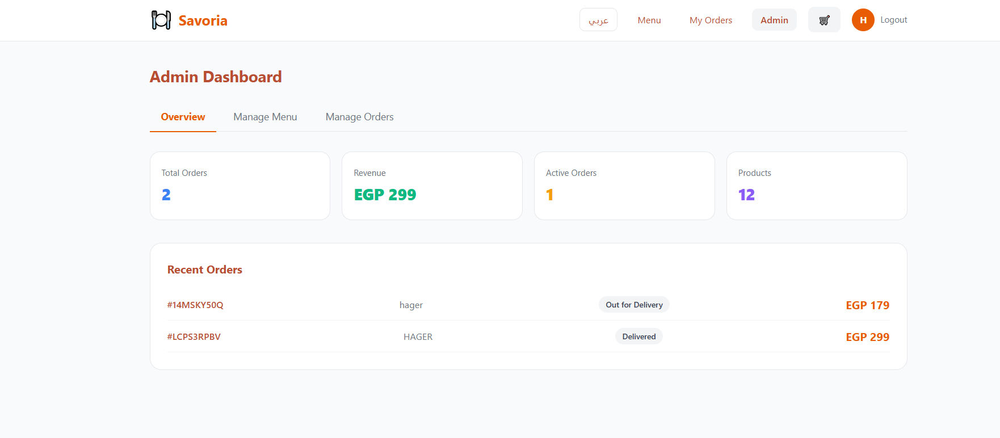

# 🍽️ Savoria - Online Food Ordering App

A full-featured food ordering web application built with **Next.js 14**, **TypeScript**, and **React Context API**.

## 🔗 Live Demo
[savoria.vercel.app](https://savoria.vercel.app)

## ✨ Features

- 🛒 **Menu & Cart** — Browse dishes, add to cart, adjust quantities
- 🔐 **Authentication** — Register & login with email/password validation
- 💳 **Payment Options** — Cash on Delivery or Online Payment
- 📦 **Order Tracking** — Real-time status tracking with progress bar
- ⚙️ **Admin Dashboard** — Manage products & update order statuses
- 🌍 **Multi-language** — Full Arabic & English support with RTL layout
- 💾 **Persistent Storage** — Data saved in localStorage across sessions

## 🛠️ Tech Stack

- **Framework:** Next.js 14 (App Router)
- **Language:** TypeScript
- **State Management:** React Context API + localStorage
- **Styling:** Inline styles (no external CSS library)

## 🚀 Getting Started

### Prerequisites
- Node.js 18+
- npm or yarn

### Installation

1. Clone the repository:
\`\`\`bash
git clone https://github.com/USERNAME/savoria.git
cd savoria
\`\`\`

2. Install dependencies:
\`\`\`bash
npm install
\`\`\`

3. Run the development server:
\`\`\`bash
npm run dev
\`\`\`

4. Open [http://localhost:3000](http://localhost:3000)

## 👤 Test Accounts

| Role  | Email             | Password   |
|-------|-------------------|------------|
| Admin | admin@savoria.com | admin123   |
| User  | user@savoria.com  | user123    |

> **Note:** Register these accounts first via the Sign Up page.

## 📁 Project Structure

\`\`\`
src/
├── app/
│   ├── page.tsx          # Menu page
│   ├── cart/             # Cart page
│   ├── checkout/         # Checkout page
│   ├── orders/           # Order tracking
│   ├── admin/            # Admin dashboard
│   └── login/            # Authentication
├── components/
│   ├── Navbar.tsx
│   ├── ProductCard.tsx
│   ├── OrderCard.tsx
│   ├── AdminMenu.tsx
│   ├── AdminOrders.tsx
│   └── Notification.tsx
├── context/
│   └── AppContext.tsx     # Global state
├── data/
│   ├── products.ts
│   └── translations.ts
└── types/
    └── index.ts
\`\`\`

## 📸 Screenshots

| Menu | Cart | Admin |
|------|------|-------|
|  |  |  |
